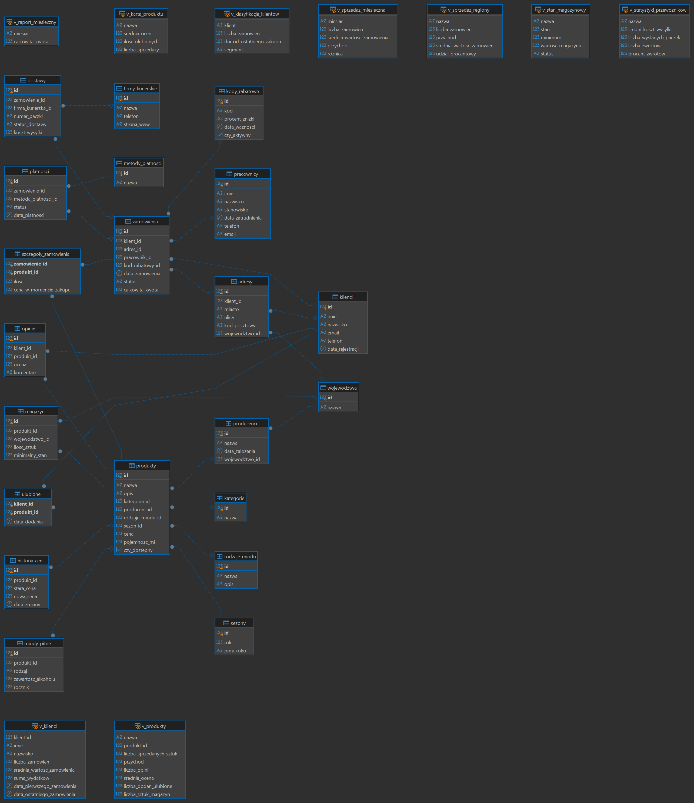
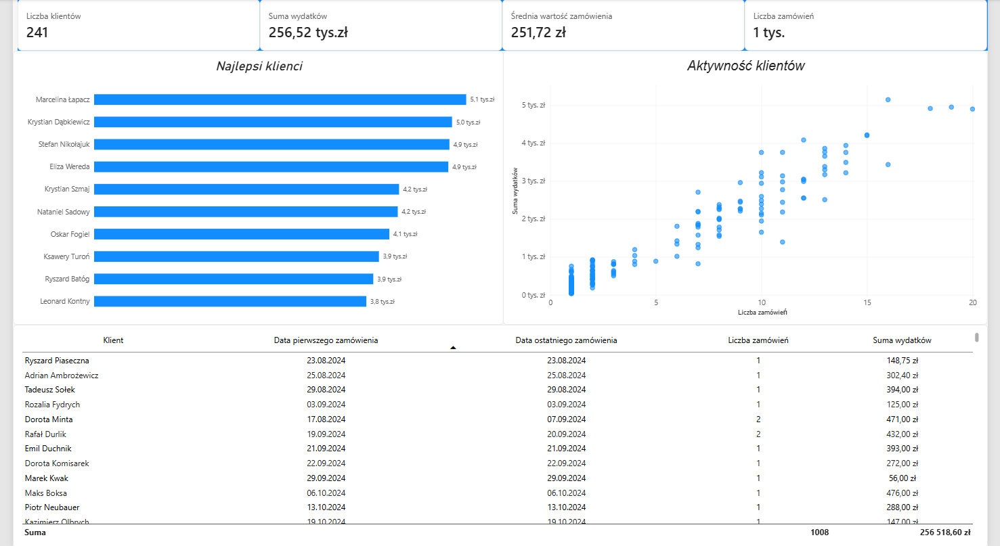
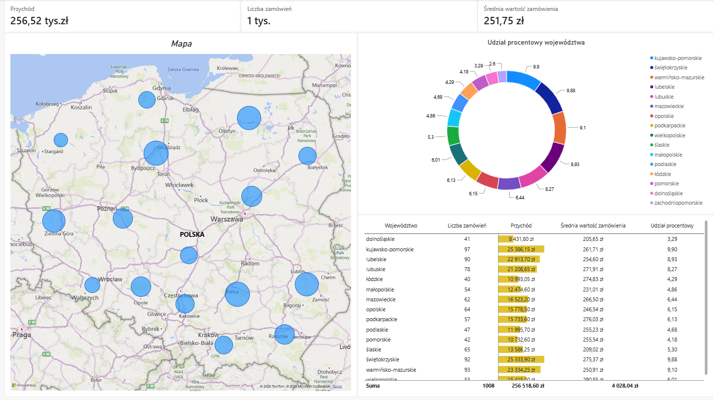
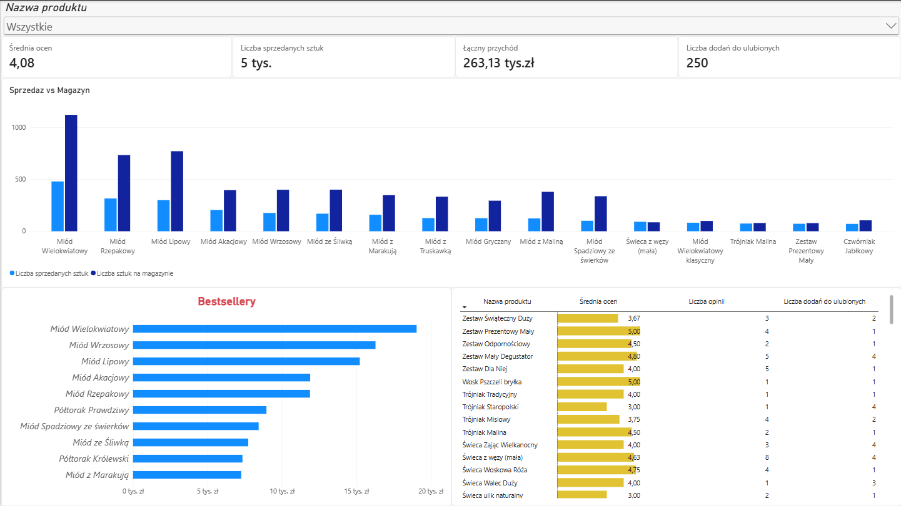
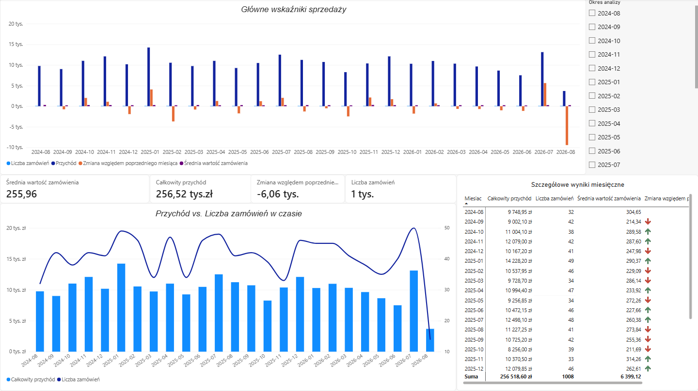

# Sklep z produktami pszczelarskimi - Data Analysis & Relational Database Project

## O projekcie:
Projekt symulujący działanie systemu bazodanowego dla sklepu internetowego z produktami pszczelarskimi.
Projekt obejmuje: wygenerowanie sztucznych danych, zaprojektowanie struktury i logiki w PostgreSQL oraz zaawansowaną analizę przy pomocy Power BI

## Wykorzystane technologie:
* **Baza Danych:** PostgreSQL (DDL, DML, DQL)
* **Programowanie Bazy:** PL/pgSQL
* **Skrypty:** Python (wykorzystanie biblioteki Faker do generowania danych)
* **Narzędzia analityczne:** Power BI, DBeaver

## Struktura:
* `sql` - skrypty bazy danych (tabele, widoki, procedury, wyzwalacze),
* `python` - skrypt generujący bazę losowych klientów i adresów,
* `powerbi` - główny plik raportu (.pbix),
* `images` - zrzuty ekranu dashboardów i schematy

## Architektura i Logika Biznesowa (ERD)
Zaprojektowna baza danych nie służy tylko do przechowywania danych. Posiada również mechanizmy, które mają za zadanie dbać o integralność i logikę wykonywanych operacji (procedury i triggery)

## Dashboardy Analityczne (Power BI)

### 1. Klienci
Podsumowanie wydatków klientów oraz ich aktywności

### 2. Analiza Regionalna
Geolokalizacja klientów i sprzedaży (mapowanie przychodów na województwa).

### 3. Logistyka i Produkty
Analiza bestsellerów, stanów magazynowych oraz opinii klientów.

### 4. Sprzedaż
Podsumowanie liczby zamówień oraz przychodów

